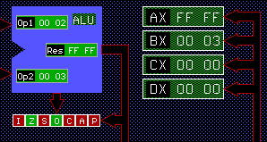

# Laboratorio 1
### Assembler básico.

En todos los casos realizar el diagrama de flujo correspondiente a cada programa y luego
codificarlo. Utilizar el simulador MSX88 para visualizar el funcionamiento de cada programa.


**Ejercicio 1:** Codifique un programa que sume dos números con las siguientes
características:

a) Los dos números a sumar se encuentran en los registros AX y BX.

```assembly

ORG 2000h
ADD AX, BX
END

```

b)  Uno de los números a sumar se encuentra en un registro, mientras que el otro se
encuentra en memoria.

```assembly

ORG 1000h
var1 dw 5

ORG 2000h
ADD AX, var1
END

```

c) ¿Cómo realizaría la suma de dos números que se encuentran almacenados en la
memoria?

No puedo sumar directamente dos variables, voy a pasar una variable a un registro.

```àssemby

ORG 1000h

var1 dw 5
var2 dw 2

ORG 2000h

MOV Al, var2
ADD var1, Al

END

```

d) ¿Qué ocurre si el resultado de la suma excede el tamaño del registro en el que se
almacena?

Si excede el resultado, se prende el flag de carry, en este caso de zero
```àssemby

ORG 2000h

MOV AX, 0FFFFh
ADD AX, 1

HLT
END

```


La solución seria sumar con carry

Por ejemplo quiero sumar


| Valor real    | Parte alta    | Parte baja    |
| ------------- | ------------- | ------------- |
| 1FFFF         | BX 1          | AX      FFFF  |
| 00002         | DX 0          | CX      2     |
| ------------- | ------------- | ------------- |
| 20000         | BX 2          | AX      0001  |

```àssemby

ORG 2000h

MOV AX, 0FFFFh
MOV BX, 1
MOV CX, 2
MOV DX, 0

ADD AX, CX
ADC BX, DX

HLT
END
```

**Ejercicio 2:** Codifique un programa que reste dos números. ¿Qué ocurre si el resultado es
menor a 0?

```assembly

ORG 2000h
MOV AX, 2
MOV BX, 3
SUB AX, BX
END
```

Lo que me sucede es que se ensiende el flag de signo y invierte el valor



**Ejercicio 3:** Codifique un programa que sea capaz de multiplicar dos números teniendo encuenta el set de instrucciones del MSX88. Para ello:

a) Dividir la memoria entre el espacio para las variables necesarias y el espacio delcódigo principal del programa.

b) Modifique el código anterior y realice una subrutina para la multiplicación que sea llamada desde el programa principal.


```àssemby
	ORG 1000H
NUM1	DB	5H
NUM2	DB	3H

	ORG 2000H
        MOV AL, NUM1
        CMP AL, 0
        JZ  FIN
        MOV AH, 0
        MOV DX, 0
        MOV CL, NUM2
LOOP:	CMP CL, 0
        JZ  FIN
        ADD DX, AX
        DEC CL
        JMP LOOP
FIN:	HLT
	END

```

**Ejercicio 4:** Codifique un programa que sea capaz de contar la cantidad de letras “a”
presentes en una cadena de caracteres.

```àssemby
;Memoria de Datos
	ORG 1000H
MSJ	DB  "ARQUTECTURA DE COMPUTADORAS"
FIN     DB  "?"

;Memoria de Instrucciones
	ORG 2000H
        
        MOV BX, OFFSET MSJ
        MOV AL, OFFSET FIN - OFFSET MSJ
LOOP:	CMP AL, BX
        JZ  RES
        CMP AL, "A"
        ADD DX, 1
        DEC AL
        JMP LOOP
RES:	HLT
	    END

```


